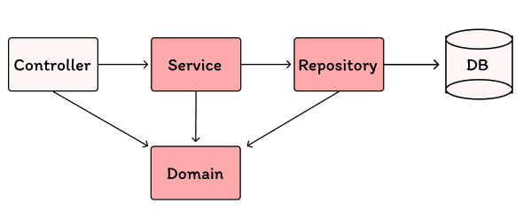

# Motivation

졸업요건계산기 기능개발을 하고 싶지만 제약조건이 많았다. 그 중 하나는 서버 개발 리소스가 부족하다는 점, 두 번째는 졸업요건계산기 flow 중 부족한 강의 추천이 이루어져야 한다. 기존 수위키 강의 평가 서비스와 연동이 필요하기 때문에 데이터를 주고 받아야 한다. 기존 데이터베이스 구조를 살펴보고 적합한 기술 스택을 선정하여 개발하고자 살펴보았다.

# 기존 수위키 서버 구조

## 기술 스택

| BASE          | DB    | Deploy Environment |
|---------------|-------|---------------------|
| Java 17       | MySQL | AWS                 |
| Spring Boot   |       | RDS                 |
| Spring Data JPA |     | Ubuntu              |
| Spring Security |    | NGINX               |
| Gradle        |       |                     |

Java 와 Spring 기반의 기술 스택으로 DB는 MySQL을 사용하고 있다. AWS의 RDS를 사용하여 데이터베이스를 구축하고 있다. 서버는 Ubuntu를 사용하고 있으며, NGINX를 사용하여 프록시 서버를 구축하고 있다.

## 데이터베이스 구조

수위키 서버에서 참고해야할 구조는 다음과 같다.

- User

```sql
TABLE user (
  id BIGINT PRIMARY KEY,
  login_id VARCHAR(50),
  password VARCHAR(100),
  email VARCHAR(50),
  restricted_count INT,
  restricted TINYINT(1),
  role ENUM('user', 'admin'),
  written_exam INT,
  written_evaluation INT,
  point INT,
  last_login DATETIME,
  requested_quit_date DATETIME,
  created_at DATETIME,
  updated_at DATETIME
);
```

- Lecture

```sql
TABLE lecture (
  id BIGINT PRIMARY KEY,
  semester_list TEXT,
  place_schedule TEXT,
  lecture_name VARCHAR(200),
  professor VARCHAR(200),
  lecture_code VARCHAR(100),
  point FLOAT,
  capsr_type VARCHAR(100),
  evaluate_type VARCHAR(100),
  dci_cd VARCHAR(100),
  memo TEXT,
  create_date DATETIME,
  modified_date DATETIME,
  lecture_total_avg FLOAT,
  lecture_satisfaction_avg FLOAT,
  lecture_homework_avg FLOAT,
  lecture_team_avg FLOAT,
  lecture_learning_avg FLOAT,
  lecture_difficulty_avg FLOAT,
  lecture_satisfaction_value FLOAT,
  lecture_homework_value FLOAT,
  lecture_team_value FLOAT,
  lecture_learning_value FLOAT,
  lecture_difficulty_value FLOAT,
  lecture_total_value FLOAT
);
```

## 서버 구조

수위키 내부 서버 구조는 크게 다음과 같다.



각각의 도메인 디렉토리 내에 아래와 같이 나뉘어 있다.
- Controller
- Service
- Domain

Controller : 클라이언트의 요청을 받아서 응답을 반환하는 역할
Service : 컨트롤러에 필요한 핵심 비즈니스 로직 구현
Domain : 비즈니스 도메인 객체를 정의

Doamin 디렉토리 하위
- Repository : 데이터베이스와 연동하여 데이터를 가져오거나 저장하는 로직 구현(dao)

이와 같은 구조로 각 레이어마다 상호 작용하며 서비스를 이루고 있다. 

다시 정리하면 Controller는 요청을 받아 응답을 반환하는 역할만 수행하고, Service는 비즈니스 로직을 처리하며, Repository는 데이터베이스와 상호작용한다. Domain 객체는 애플리케이션의 핵심 비즈니스 객체를 정의하며, 비즈니스 로직을 포함하고 있다.

ex) lecture/domain/Lecture.java
```java
package usw.suwiki.domain.lecture.domain;

import java.util.ArrayList;
import java.util.List;
import java.util.regex.Pattern;
import javax.persistence.CascadeType;
import javax.persistence.Column;
import javax.persistence.Embedded;
import javax.persistence.Entity;
import javax.persistence.GeneratedValue;
import javax.persistence.GenerationType;
import javax.persistence.Id;
import javax.persistence.OneToMany;
import lombok.AccessLevel;
import lombok.Builder;
import lombok.Getter;
import lombok.NoArgsConstructor;
import usw.suwiki.domain.evaluatepost.domain.EvaluatePost;
import usw.suwiki.domain.evaluatepost.service.dto.EvaluatePostsToLecture;
import usw.suwiki.global.BaseTimeEntity;

@Entity
@Getter
@NoArgsConstructor(access = AccessLevel.PROTECTED)
public class Lecture extends BaseTimeEntity {
    @Id
    @GeneratedValue(strategy = GenerationType.IDENTITY)
    private Long id;

    @Column(name = "semester_list")
    private String semester;

    private String professor;

    @Column(name = "lecture_name")
    private String name;

    @Column(name = "major_type")
    private String majorType;

    @Column(name = "lecture_type")
    private String type;

    @Embedded
    private LectureEvaluationInfo lectureEvaluationInfo;

    @Embedded
    private LectureDetail lectureDetail;

    private int postsCount = 0;

    @OneToMany(mappedBy = "lecture", cascade = CascadeType.ALL, orphanRemoval = true)
    private final List<LectureSchedule> scheduleList = new ArrayList<>();

    @OneToMany(mappedBy = "lecture", cascade = CascadeType.ALL, orphanRemoval = true)
    private final List<EvaluatePost> evaluatePostList = new ArrayList<>();

    @Builder
    public Lecture(
            String semester,
            String professor,
            String name,
            String majorType,
            String type,
            LectureDetail lectureDetail
    ) {
        this.semester = semester;
        this.professor = professor;
        this.name = name;
        this.majorType = majorType;
        this.type = type;
        this.lectureDetail = lectureDetail;
        this.lectureEvaluationInfo = new LectureEvaluationInfo();
    }

    /**
     * 연관관계 메서드
     */
    public void addEvaluatePost(EvaluatePost evaluatePost) {
        this.evaluatePostList.add(evaluatePost);
    }

    public void removeEvaluatePost(EvaluatePost evaluatePost) {
        this.evaluatePostList.remove(evaluatePost);
    }

    public void addSchedule(LectureSchedule lectureSchedule) {
        this.scheduleList.add(lectureSchedule);
    }

    public void removeSchedule(LectureSchedule lectureSchedule) {
        this.scheduleList.remove(lectureSchedule);
    }
    
    /**
     * 비즈니스 메서드
     */

    public void handleLectureEvaluationIfNewPost(EvaluatePostsToLecture post) {
        this.addLectureEvaluation(post);
        this.calculateAverage();
    }

    public void handleLectureEvaluationIfUpdatePost(EvaluatePostsToLecture beforeUpdatePost,
                                                   EvaluatePostsToLecture updatePost) {
        this.cancelLectureEvaluation(beforeUpdatePost);
        this.addLectureEvaluation(updatePost);
        this.calculateAverage();
    }

    public void handleLectureEvaluationIfDeletePost(EvaluatePostsToLecture post) {
        this.cancelLectureEvaluation(post);
        this.calculateAverage();
    }

    private void addLectureEvaluation(EvaluatePostsToLecture dto) {
        this.lectureEvaluationInfo.addLectureValue(dto);
        increasePostCount();
    }

    private void calculateAverage() {
        if (postsCount < 1) {
            this.lectureEvaluationInfo.calculateIfPostCountLessThanOne();
            return;
        }
        this.lectureEvaluationInfo.calculateLectureAverage(this.postsCount);
    }

    private void increasePostCount() {
        this.postsCount += 1;
    }

    public void addSemester(String singleSemester) {
        validateSingleSemester(singleSemester);
        if (this.semester.isEmpty() || this.semester.contains(singleSemester)) {
            return;
        }

        this.semester = extendSemester(this.semester, singleSemester);
    }


    public void removeSemester(String singleSemester) {
        validateSingleSemester(singleSemester);
        if (this.semester.contains(singleSemester)) {
            this.semester = this.semester.replace(buildAddedSingleSemester(singleSemester), "");
        }
    }

    ... 생략

}
```
역할 (비지니스 메소드가 있는 이유는 이해 못함)
- Lecture 엔티티를 정의
- Lecture 엔티티는 데이터베이스 테이블과 매핑되는 JPA 엔티티로, 강의 정보를 저장하고 관리
- 엔티티 클래스는 데이터의 상태와 행위를 캡슐화


ex) lecture/domain/repository/LectureCustomRepository.java

```java
package usw.suwiki.domain.lecture.domain.repository;

import java.util.List;
import java.util.Optional;
import org.springframework.data.domain.Slice;
import usw.suwiki.domain.lecture.controller.dto.LectureFindOption;
import usw.suwiki.domain.lecture.domain.Lecture;
import usw.suwiki.domain.lecture.domain.LectureSchedule;
import usw.suwiki.domain.lecture.domain.repository.dao.LecturesAndCountDao;

public interface LectureCustomRepository {

    Slice<Lecture> findCurrentSemesterLectures(
        final Long cursorId,
        final int limit,
        final String keyword,
        final String majorType,
        final Integer grade
    );

    List<LectureSchedule> findAllLectureSchedulesByLectureSemesterContains(String semester);

    Optional<Lecture> findByExtraUniqueKey(
        String lectureName,
        String ProfessorName,
        String majorType,
        String dividedClassNumber
    );

    List<String> findAllMajorType();

    LecturesAndCountDao findLectureByFindOption(
        String searchValue,
        LectureFindOption lectureFindOption
    );

    LecturesAndCountDao findLectureByMajorType(
        String searchValue,
        LectureFindOption lectureFindOption
    );

    LecturesAndCountDao findAllLectureByFindOption(LectureFindOption lectureFindOption);

    LecturesAndCountDao findAllLectureByMajorType(LectureFindOption lectureFindOption);
}
```

역할
- Lecture 엔티티와 관련된 커스텀 쿼리 메서드를 정의
- LectureCustomRepository 인터페이스는 사용자 정의 메서드를 선언하고, 이러한 메서드는 Lecture 엔티티에 대한 특정한 쿼리 로직을 구현

## 정리

가장 중요한건 수위키의 강의평가 정보를 가지고 와서 졸업요건계산기에 적용하는 것이다. 이를 위해 수위키 서버와 연동하여 데이터를 주고 받아야 한다. 이를 위해 수위키 서버의 데이터베이스 구조와 서버 구조를 살펴보았다.

# 졸업요건계산기 정보

## 크롤링을 통해 가져온 데이터

```json
[
    {
        "subjtEstbYear": "2024", // 과목 개설 연도
        "sno": "17019013", // 학생 번호
        "diclNo": "002", // 강좌 번호
        "timtSmryCn": "IT309(목2,3,4)", // 시간표 요약 내용 (강의실 및 시간)
        "estbDpmjNm": "미디어SW", // 개설 학과 이름
        "subjtNm": "데이터베이스", // 과목 이름
        "refacYearSmr": "-", // 대체 과목 연도 및 학기
        "closeYn": "N", // 폐강 여부
        "facDvcd": "22", // 강의 구분 코드
        "point": 3, // 학점
        "ltrPrfsNm": "신호진", // 담당 교수 이름
        "subjtEstbYearSmr": "2024-1학기", // 과목 개설 연도 및 학기
        "subjtEstbSmrCd": "10", // 과목 개설 학기 코드
        "facDvnm": "전선", // 강의 구분 이름 (전공 선택)
        "subjtCd": "01762" // 과목 코드
    },
    {
        "subjtEstbYear": "2024", // 과목 개설 연도
        "sno": "17019013", // 학생 번호
        "diclNo": "003", // 강좌 번호
        "timtSmryCn": "IT307(화1,2,3)", // 시간표 요약 내용 (강의실 및 시간)
        "estbDpmjNm": "정보통신학부", // 개설 학과 이름
        "subjtNm": "컴퓨터네트워크", // 과목 이름
        "refacYearSmr": "-", // 대체 과목 연도 및 학기
        "closeYn": "N", // 폐강 여부
        "facDvcd": "26", // 강의 구분 코드
        "point": 3, // 학점
        "ltrPrfsNm": "변희정", // 담당 교수 이름
        "subjtEstbYearSmr": "2024-1학기", // 과목 개설 연도 및 학기
        "subjtEstbSmrCd": "10", // 과목 개설 학기 코드
        "facDvnm": "전필", // 강의 구분 이름 (전공 필수)
        "subjtCd": "06547" // 과목 코드
    },
    {
        "subjtEstbYear": "2024", // 과목 개설 연도
        "sno": "17019013", // 학생 번호
        "diclNo": "004", // 강좌 번호
        "timtSmryCn": "종합308(수1,2,3)", // 시간표 요약 내용 (강의실 및 시간)
        "estbDpmjNm": "교양", // 개설 학과 이름
        "subjtNm": "일본어Level1", // 과목 이름
        "refacYearSmr": "-", // 대체 과목 연도 및 학기
        "closeYn": "N", // 폐강 여부
        "facDvcd": "17", // 강의 구분 코드
        "point": 3, // 학점
        "ltrPrfsNm": "방윤형", // 담당 교수 이름
        "subjtEstbYearSmr": "2024-1학기", // 과목 개설 연도 및 학기
        "subjtEstbSmrCd": "10", // 과목 개설 학기 코드
        "facDvnm": "선택교양", // 강의 구분 이름 (선택 교양)
        "subjtCd": "10110" // 과목 코드
    }
]

```

졸업요건에 필요한 데이터만 추출해본다.

```json
[
  {
    "sno": "17019013", // 학생 번호
    "subjtCd": "01762", // 과목 코드
    "subjtNm": "데이터베이스", // 과목 이름
    "point": 3, // 학점
    "facDvnm": "전선", // 강의 구분 이름 (전공 선택)
    "subjtEstbYearSmr": "2024-1학기", // 과목 개설 연도 및 학기
    "closeYn": "N" // 폐강 여부
  },
  {
    "sno": "17019013", // 학생 번호
    "subjtCd": "06547", // 과목 코드
    "subjtNm": "컴퓨터네트워크", // 과목 이름
    "point": 3, // 학점
    "facDvnm": "전필", // 강의 구분 이름 (전공 필수)
    "subjtEstbYearSmr": "2024-1학기", // 과목 개설 연도 및 학기
    "closeYn": "N" // 폐강 여부
  },
  {
    "sno": "17019013", // 학생 번호
    "subjtCd": "10110", // 과목 코드
    "subjtNm": "일본어Level1", // 과목 이름
    "point": 3, // 학점
    "facDvnm": "선택교양", // 강의 구분 이름 (선택 교양)
    "subjtEstbYearSmr": "2024-1학기", // 과목 개설 연도 및 학기
    "closeYn": "N" // 폐강 여부
  }
]
```

## 졸업요건계산기 도메인 규칙

사실 이 부분이 서버로직을 개발하는 것 보다 까다로운 것 같다. 학년, 학과별로 또 복수전공, 외국인학생, 편입생인지에 따라도 나뉜다. 또한 어떤 학점을 초과하여 수강할 경우 강의 구분이 일반 선택 교양으로 넘어가기도 함에 따라 굉장히 복잡한 요구사항이다.

예시로 2017년도에 입학한 정보통신학과인 김민규의 경우 졸업을 위하여 다음과 같은 수강 학점을 만족해야 한다.
- 중요핵심 4학점 
- 기초교양 18학점 
- 선택교양 18학점 
- 소양교육 1학점  
- 전공기초교양 9학점 
- 전공필수 진로취업 3학점 전공필수 
- 전공필수 핵심 21학점 
- 전공 선택 42학점 
- 전공심화 14학점

총 130학점을 채워야 한다. 이는 일반적인 사례일 뿐 위에서 말했듯이 다양한 케이스가 존재한다.

### 졸업요건계산기 기능 개발 계획

요구사항

1. 졸업요건 계산: 사용자가 수강한 강의 데이터를 입력하면 졸업 요건을 자동으로 계산해주는 기능. 
2. 부족한 강의 추천: 졸업 요건을 충족하지 못한 경우, 수위키의 강의 평가 데이터를 바탕으로 부족한 강의를 추천해주는 기능.
3. 연동 기능: 수위키 서버와 연동하여 강의 평가 데이터를 가져와서 사용하는 기능.

## 기술 스택

내가 생각하였을 때 가장 이상적인 기술스택은 Java와 Spring 기반의 기술 스택이다. 수위키 서버와 연동해야 하기 때문에 수위키 서버와 동일한 기술 스택을 사용하는 것이 가장 이상적이라고 생각한다.
그러나 서버 리소스가 부족하다는 점 때문에 다른 선택지를 고려해보았다.

- [NestJS](https://docs.nestjs.com/) 

장점

- TypeScript 지원: 정적 타입 검사로 코드 품질 향상.
- 모듈화: 잘 구조화된 코드 작성 가능.
- 강력한 의존성 주입: 코드 재사용성 및 테스트 용이.
- 풍부한 기능: 인증, 권한 관리, GraphQL, WebSockets 등을 쉽게 통합 가능.
- Active Community: 지속적인 업데이트와 많은 예제 및 문서.

단점 

- 작은 프로젝트에 비해 초기 설정 및 구성 작업이 많음

- [Fastify](https://fastify.dev/)

장점

- 성능: 매우 빠르고 낮은 오버헤드.
- 간단한 API: 빠른 개발 가능.
- 플러그인 시스템: 기능 확장 및 재사용성 용이.
- Schema 기반 검증: JSON Schema를 사용한 요청 및 응답 검증.

단점

- 미들웨어 부족: nestjs 비해 미들웨어가 적음.
- 커뮤니티가 작다.

- [Superbase](https://supabase.com/)

장점

- 서버리스: 백엔드 서버를 구축하지 않아도 되는 서버리스 기능.
- 빠른 시작: 빠르고 쉽게 백엔드 설정 가능.

단점

- 제한된 기능: 서버리스로 인해 제한된 기능.
- 커스터마이징 어려움: 서버리스로 인해 커스터마이징이 어려움.
- 의존성: 특정 클라우드 서비스에 의존.
- 비용: 서비스가 커질 경우 유료 플랜을 사용해야한다.


## 결론

수위키 서버와 연동하여 데이터를 주고 받아야 하기 때문에 수위키 서버와 동일한 기술 스택을 사용하는 것이 가장 이상적이라고 생각한다. 그러나 서버 리소스가 부족하다는 점 때문에 다른 선택지를 고려해보았다. 
기획+프론트+서버 개발의 role을 가져가기 위하여, 이후에 추가적인 기능확장을 위하여 어떤 기술을 선택해야 할지 고민이다.
