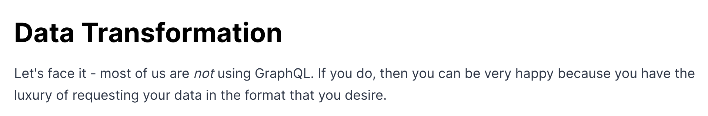

# Motivation

교내 수위키 과거 코드를 살펴보며 client단에서도 dto를 적용하는 걸 보았습니다. 그동안 웹 개발 프론트엔드 씬에서 dto란 개념을 잘 듣지 못했고 신경쓰지 않고서 살았는데 이는 제가 Graphql을 사용하고 있었기 때문입니다. 따라서 dto에 대하여 공부하고 적용법을 서술합니다.

# DTO란 무엇인가?

> 위키피디아 정의
>
>
> In the field of programming a **data transfer object** (**DTO**[[1]](https://en.wikipedia.org/wiki/Data_transfer_object#cite_note-msdn-1)[[2]](https://en.wikipedia.org/wiki/Data_transfer_object#cite_note-fowler-2)) is an object that carries data between processes. The motivation for its use is that communication between processes is usually done resorting to remote interfaces (e.g., web services), where each call is an expensive operation.[[2]](https://en.wikipedia.org/wiki/Data_transfer_object#cite_note-fowler-2) Because the majority of the cost of each call is related to the round-trip time between the client and the server, one way of reducing the number of calls is to use an object (the DTO) that aggregates the data that would have been transferred by the several calls, but that is served by one call only.[[2]](https://en.wikipedia.org/wiki/Data_transfer_object#cite_note-fowler-2)
>
> The difference between data transfer objects and [business objects](https://en.wikipedia.org/wiki/Business_object) or [data access objects](https://en.wikipedia.org/wiki/Data_access_object) is that a DTO does not have any behavior except for storage, retrieval, serialization and deserialization of its own data ([mutators](https://en.wikipedia.org/wiki/Mutator_method), [accessors](https://en.wikipedia.org/wiki/Method_(computer_programming)), [serializers](https://en.wikipedia.org/wiki/Serialization) and [parsers](https://en.wikipedia.org/wiki/Parsing)). In other words, DTOs are simple objects that should not contain any business logic but may contain serialization and deserialization mechanisms for transferring data over the wire.[[1]](https://en.wikipedia.org/wiki/Data_transfer_object#cite_note-msdn-1)
>
> This [pattern](https://en.wikipedia.org/wiki/Software_design_pattern) is often incorrectly used outside of remote interfaces. This has triggered a response from its author[[3]](https://en.wikipedia.org/wiki/Data_transfer_object#cite_note-fowlerLocalDTO-3) where he reiterates that the whole purpose of DTOs is to shift data in expensive remote calls.
>

DTO(**Data Transfer Object**)는 프로세스 간에 데이터를 전달하는 객체이다. 위키피디아에 따르면, “DTO는 데이터를 전송하기 위해 만들어진 객체로, 주로 원격 인터페이스 간의 통신에서 사용되며, 각 호출은 비용이 많이 드는 작업이다. DTO는 여러 호출을 통해 전달될 데이터를 하나의 객체로 묶어 한 번의 호출로 전달하는 데 사용된다.

# React에서의 DTO

웹 프론트엔드 개발자인 내가 자주 사용하는 기술인 React에서 DTO를 사용하는 사례는 다음과 같다.

```sql
// types.ts

// ex) UserApiResponse
export interface UserApiResponse {
  id: number;
  username: string;
  email: string;
  createdAt: string;
  updatedAt: string;
  profilePicture: string;
  role: string;
  lastLogin: string;
}

// ex) UserComponentInterface
export interface UserDTO {
  id: number;
  username: string;
  email: string;
  profilePicture: string;
}
```

```sql
// dto.ts
import { UserApiResponse, UserDTO } from './types';

export function transformToUserDTO(data: UserApiResponse): UserDTO {
  return {
    id: data.id,
    username: data.username,
    email: data.email,
    profilePicture: data.profilePicture,
  };
}
```

```sql
// api.ts
import axios from 'axios';
import { UserApiResponse } from './types';

export const fetchUserData = async (userId: string): Promise<UserApiResponse> => {
  const response = await axios.get<UserApiResponse>(`/api/users/${userId}`);
  return response.data;
};
```

```sql
// UserComponent.tsx
import React, { useEffect, useState } from 'react';
import { fetchUserData } from './api';
import { transformToUserDTO, UserDTO } from './dto';

interface UserComponentProps {
  userId: string;
}

const UserComponent: React.FC<UserComponentProps> = ({ userId }) => {
  const [user, setUser] = useState<UserDTO | null>(null);
  const [loading, setLoading] = useState(true);
  const [error, setError] = useState<string | null>(null);

  useEffect(() => {
    const loadData = async () => {
      try {
        const userData = await fetchUserData(userId);
        const userDTO = transformToUserDTO(userData);
        setUser(userDTO);
      } catch (err) {
        setError(err.message);
      } finally {
        setLoading(false);
      }
    };

    loadData();
  }, [userId]);

  if (loading) return <p>Loading...</p>;
  if (error) return <p>Error: {error}</p>;

  return (
    <div>
      
      <h1>{user?.username}</h1>
      <p>{user?.email}</p>
    </div>
  );
};

export default UserComponent;
```

```sql
// react-query를 사용한다면...
// 이 함수가 DTO 역할
const transformTodoNames = (data: Todos) => data.map((todo) => todo.name.toUpperCase());

export const useTodosQuery = () =>
  useQuery({
    queryKey: ['todos'],
    queryFn: fetchTodos,
    select: transformTodoNames,
  });

```

나는 DTO를 사용하는 이유는 주로 서버에서 가져온 데이터를 클라이언트에서 적절히 처리하고 UI에 렌더링하기 위해서이다. 서버에서 전달되는 데이터가 복잡하거나 불필요한 정보가 포함되어 있을 때, DTO를 사용하여 필요한 정보만 추출하고 가공함으로써 데이터 일관성을 유지하고 코드의 가독성과 유지보수성을 높일 수 있다.

일전에 GraphQL과 Relay를 통해 컴포넌트에 필요한 데이터는 해당 컴포넌트에서 직접 선언해서 fetching 해왔기 때문에 DTO의 존재감을 크게 느끼지 못했다.

# **Rest API와 GraphQL**



너무 웃겨서 넣음

그리고 DTO를 사용하여 데이터를 client에서 재가공하는 것이 SSOT(Single Source of Truth)를 위반한다고 생각했다. 따라서 굳이 서버가 잘 해주면 되는 거 아닌가? 아니면 Schema를 백엔드 개발자와 프론트엔드 개발자가 협의하며 설계하는데 필요한가? 라고 생각해왔는데 항상 BFF(Backend for Frontend) 환경에서 개발하며 왕자님 취급을 받던 프론트엔드라 그런 것 같다. 현실에서 모든 REST API는 RESTful을 지향하지만 아래와 같은 상황일 경우 100% 충족시키지 못한다.

1.	**백엔드와 프론트엔드의 데이터 요구사항 불일치**: 백엔드 시스템이 프론트엔드와 다른 요구사항을 가지는 경우, 백엔드에서 제공하는 데이터와 프론트엔드가 실제로 필요한 데이터가 다를 수 있.

2.	**API 설계의 제한**: 일부 API는 다양한 클라이언트의 요구를 충족하기 위해 설계되었기 때문에, 불필요한 데이터를 포함하거나 데이터 형식이 클라이언트에 최적화되지 않을 수 있다.

3.	**비즈니스 로직의 복잡성**: 클라이언트 측에서 특정 데이터 가공이나 변환이 필요한 경우, 이는 DTO를 통해 더 쉽게 관리할 수 있다.

또한 Rest api를 사용할때는 컴포넌트(View) 중심으로 데이터 응답을 설계할수는 없다. (물론 할 수는 있으나 props dilling이 발생함)

# DTO는 테스트가 필수이다.

DTO 로직은 데이터 변환과 관련된 중요한 부분이기 때문에, 테스트가 필수적이다. 테스트 코드를 작성하여 DTO가 올바르게 작동하는지 확인할 수 있다. 예를 들어, 아래와 같은 Jest 테스트 코드를 작성할 수 있다.

```sql
// dto.test.ts
import { transformToUserDTO } from './dto';
import { UserApiResponse } from './types';

test('transformToUserDTO는 UserApiResponse를 UserDTO로 변환합니다.', () => {
  const apiResponse: UserApiResponse = {
    id: 1,
    username: '김민규',
    email: 'mingyu@example.com',
    createdAt: '2021-01-01',
    updatedAt: '2021-01-02',
    profilePicture: 'http://example.com/profile.jpg',
    role: 'user',
    lastLogin: '2021-01-01'
  };

  const userDTO = transformToUserDTO(apiResponse);

  expect(userDTO).toEqual({
    id: 1,
    username: '김민규',
    email: 'mingyu@example.com',
    profilePicture: 'http://example.com/profile.jpg'
  });
});
```

# 결론

GraphQL이 아닌 Rest API를 사용하고 있다면 DTO는 거의 대부분 필요하다. 추가적으로 데이터 변환을 시켜주기 때문에 DTO 로직에는 테스트가 필수이다. 또한 DTO와 관련된 코드와 API를 문서화하여 팀원들이 쉽게 이해하고 사용할 수 있도록 한다.

DTO를 사용하면 서버와 클라이언트 간의 데이터 전송이 명확해지고, 데이터 가공이 용이해지며, 코드의 가독성과 유지보수성이 높아진다. 현실적인 제약과 다양한 요구사항을 고려할 때, DTO는 프론트엔드와 백엔드 간의 데이터 처리에 유용한 도구이다.

# 추가로 보면 좋은 것

[GraphQL Schemas vs. RESTful DTOs](https://khalilstemmler.com/articles/graphql/graphql-schemas-vs-restful-dtos/)

[Feconf 컴포넌트 다시 생각하기](https://www.youtube.com/watch?v=HYgKBvLr49c)

[Graphql 사용하기](https://www.notion.so/Graphql-35d6f6ab4ef44c2f9fdf962c51239ee0)

[리액트에서 어댑터(Adapter) 패턴을 사용하는 방법](https://velog.io/@superlipbalm/how-i-use-adapter-pattern-in-reactjs)

# 생각해볼 것

- 다른 언어 혹은 디자인 패턴에서는 어떤식으로 사용하고 있는지?


- 서버에서 DTO를 처리하는데 굳이 클라이언트에서도 DTO를 사용해야 하는가? 후에 리팩토링을 할 때 어려움을 겪지 않을지?


- 만약 겪는다면 어떤 방법으로 예방할 수 있을까?

